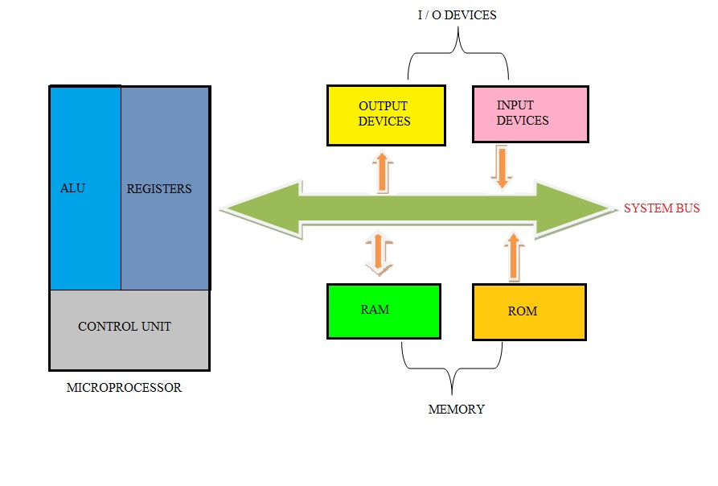

# Microcomputer

It includes microprocessor, memory and minimal input/output (I/O) mounted on PCB. Microprocessor can be programmed using assembly language. 

  

## Internal Hardware
- Processor
  - Bus Interface Unit (BIU) within processor fetches new instruction or data. It also has BIU jobs to interpret or decode instruction and to route results to proper destination.
- Memory
  - It can be Read Only Memory (ROM) or Random Access Memory (RAM)
- Registers
  

## External Hardware
- Keyboard
- Monitor

## System Bus
Information is sent from one component to another along the communication channel called system bus.

### Address Bus
Its width determines the amount of physical memory addressable by the processor

### Data Bus
Its width determines the size of the data transferred between the processor and memory or I/O device.

### Control Bus
It consists of control signals like memory read/write